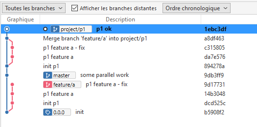
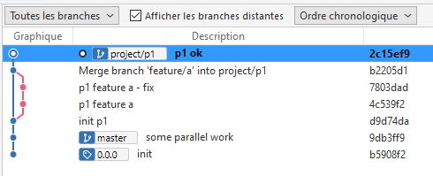
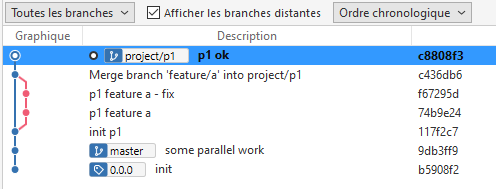

# rebase-preserve-merge

## with the feature branch (!)

### intial state


### simple rebase

Git will rewrite (rebase) these 4 commits (without the merge commit):


Git will keep the commits leading to the `feature/a` branch.

```
git checkout project/p1
git rebase master
```


### rebase --preserve-merges

Git will rewrite (rebase) all the 5 commits (including the merge commit):


Git will keep the commits leading to the `feature/a` branch.

```
git checkout project/p1
git rebase --preserve-merges master
warning: git rebase --preserve-merges is deprecated. Use --rebase-merges instead.
Successfully rebased and updated refs/heads/project/p1.
```



## without the feature branch

### intial state


### simple rebase

Git will rewrite (rebase) these 4 commits (without the merge commit):


```
git checkout project/p1
git rebase master
```


### rebase --preserve-merges

Git will rewrite (rebase) all the 5 commits (including the merge commit):


```
git checkout project/p1
git rebase --preserve-merges master
warning: git rebase --preserve-merges is deprecated. Use --rebase-merges instead.
Successfully rebased and updated refs/heads/project/p1.
```



### rebase --rebase-merges

Git will also rewrite (rebase) all the 5 commits (including the merge commit).

```
git checkout project/p1
git rebase --rebase-merges master
```

